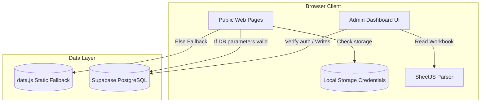
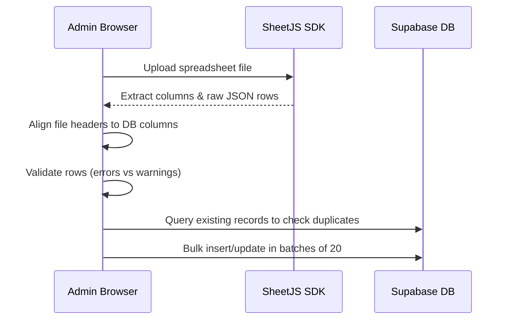

# RecoveryOn Directory — Admin Dashboard Guide

This comprehensive guide covers the design, architecture, database schemas, security configurations, and operations for RecoveryOn’s internal management interface.

---

## 1. Directory System Architecture

The RecoveryOn Directory is architected as a hybrid static/dynamic application:
1. **Public Frontend (Jamstack-compatible):** Reads resource directory files dynamically via an API client overlay. If Supabase keys are not found in browser storage, it gracefully falls back to the static `data.js` array to maintain 100% offline & GitHub Pages compatibility.
2. **Admin Management Dashboard (SPA Shell):** Located under `/admin/index.html`. Connects directly to the Supabase PostgreSQL backend using the client SDK, providing database operations without backend server relays.



---

## 2. Database Schema (`database.sql`)

The PostgreSQL database contains a normalized structure designed to handle 25,000+ records efficiently.

### Core Tables
* **`states`:** Pre-seeded lookup table for US States containing name and list arrays of cities.
* **`categories`:** Pre-seeded vocabulary for primary resource groups (e.g. Treatment Centers, Detox).
* **`taxonomy_terms`:** Configuration taxonomy terms for filtering services, levels of care, conditions, therapy types, amenities, and insurance providers.
* **`resources`:** The master record table holding comprehensive detail attributes.
* **`resource_categories` & `resource_taxonomy`:** Join tables map resources to categories and tag lists.
* **`import_batches` & `import_logs`:** Logging database records track spreadsheet imports and allow safety rollback actions.

### Triggers & Indexes
* **`idx_resources_slug` / `idx_resources_state_status`:** Maximize lookup speeds when querying public listings.
* **`update_updated_at_column`:** Triggers automatic updates to the `updated_at` column upon row modification.

---

## 3. Row-Level Security (RLS) Policies

To protect database operations, Row Level Security is enabled on tables. Public users are granted read access while write commands require authenticated admin sessions.

```sql
-- Allow anonymous select reads
CREATE POLICY "Public Read Access" 
ON public.resources 
FOR SELECT 
USING (status = 'Published');

-- Allow authenticated writes
CREATE POLICY "Admin Write Access" 
ON public.resources 
FOR ALL 
TO authenticated 
USING (true) 
WITH CHECK (true);
```

---

## 4. Excel/CSV Import Wizard Mechanics

The import wizard allows system admins to stage nationwide resource sheets in 5 steps:



### 1. Header Auto-Mapping Synonyms
The importer scans uploaded columns and matches them to DB schema fields using semantic presets:
* **Resource Name:** `facility name`, `center name`, `resource name`, `title`, `name`.
* **State:** `state code`, `state abbreviation`, `state`.
* **Coordinates:** `latitude` (`lat`), `longitude` (`lng`, `lon`).

### 2. Strict Validations
* **Errors (Block Import):** Empty names, missing city, or non-matching 2-letter US state code.
* **Warnings (Staged with Warning):** Invalid email format (missing `@`), website URLs missing protocols (`http/https`), or coordinates that are not floats.

### 3. Duplicate Prevention & Merge Actions
Admins can select key criteria to identify duplicate records:
1. **Source ID / External ID:** Exact match of unique provider identifier.
2. **Name + Location:** Match of `Resource Name` + `City` + `State`.

**Action Configuration:**
* **Skip:** Duplicate row is skipped; details remain untouched in the database.
* **Update:** Overwrites the existing database record fields with the fresh spreadsheet row values.

---

## 5. Deployment & Configuration

To activate dynamic database operations:
1. Open the [Supabase Console](https://supabase.com).
2. Execute the migrations script found in [`database.sql`](file:///d:/Antigravity%20Projects/RecoveryOn%20Directory/database.sql) using the SQL Editor.
3. Open the directory admin login at `/admin/index.html` and click **Connection Parameters**. Enter your Supabase Project URL and Anon API key.
4. Sign up/log in using Supabase Auth.
5. Enter the **Import Data** section to upload and stage your resource spreadsheets.
